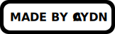

<h1 align="center">👋 Hi, I'm Caydn! 👋</h1>

<h2>👨‍💻 My Current Role 👨‍💻</h2>

 

👨‍🎓 I am currently a Software Engineering Apprentice studying for a Level 4 qualification

🚀 I am excited to learn more about software engineering and enhance my skills

<h2 align="center">👷 My Current Work 👷‍♂️</h2>

 

 

🤖 I am developing several Android apps and a website for a local charity

🧠 I am currently enrolled in multiple software engineering courses

🤔 I am considering what projects I should undertake next
 
💬 Ask me about anything; I would be happy to talk

🌐 Feel free to check out my portfolio website:

 

<h2 align="center">🔨 Languages and Tools 🔨</h2>

 

 
  

<h2 align="center">💻 Computer Specifications and Software 💻</h2>

 
 

   
 

 

     
 

         
 

 

 

 

